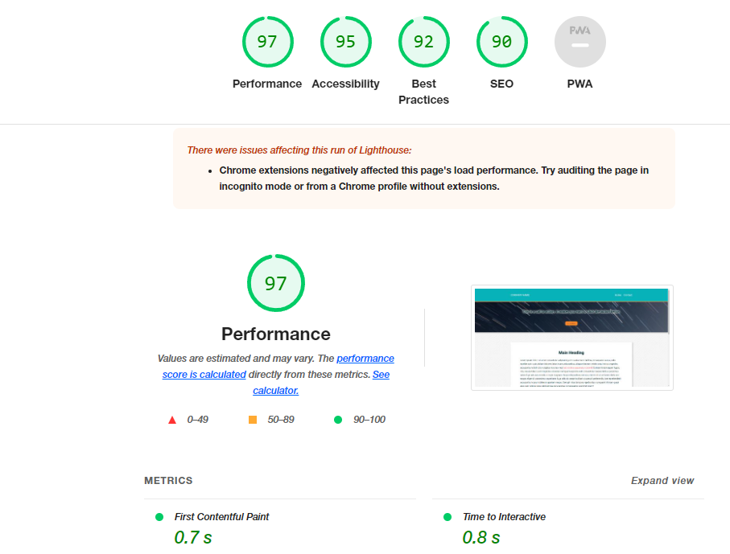

# m8-hw-8-christensen-kristine
Assignment 8: Add CSS Transitions and Animations to a Webpage
## About This Assignment ##
This assignment required that we: 
1.	The links in the page header.
2.	The button in the hero section.
3.	The links in the lorem text in the main content of the page.

## Lighthouse Report ##
